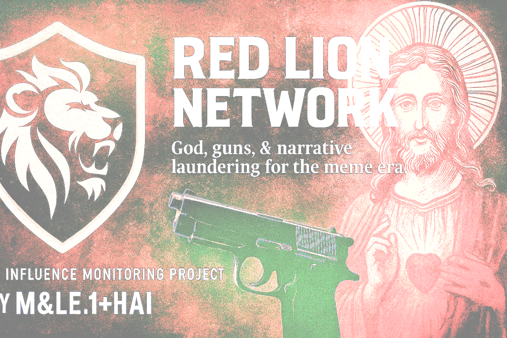
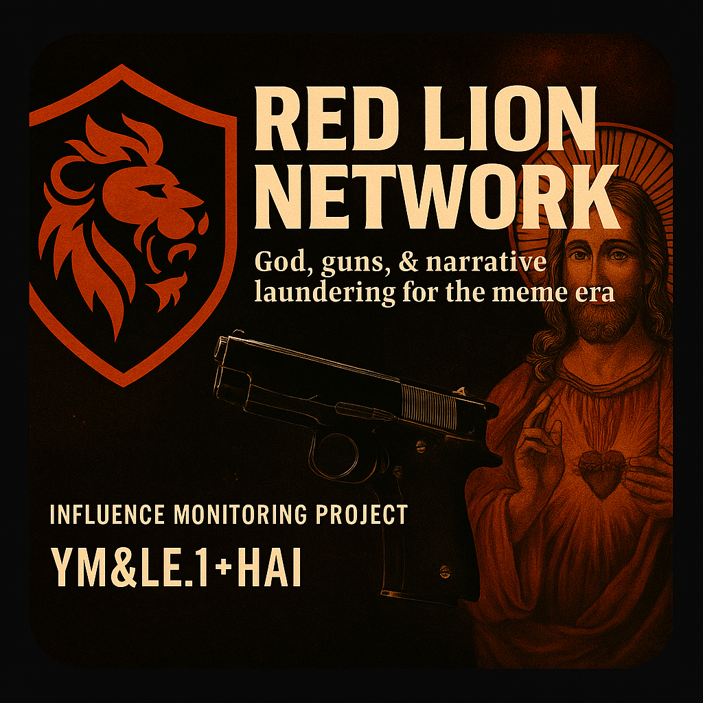

  

  

# 🦁 RED LION NETWORK 😈👿

> God, guns, and narrative laundering for the meme era.

This repo documents one of the dumbest serious threats to democracy we’ve seen in modern history.  
A minister-turned-mercenary with shell companies, a tactical cosplay wife, and a private security firm named after the Roman dudes who used to assassinate emperors.  
Oh—and AI brainwashing. And a Department of Defense tweet with the Russian flag on Flag Day.

---

## 🤡 What’s Inside

- A guy named **Boelter** who said he was a prophet, then showed up with a Glock.
- Shell companies claiming to run agriculture, media, and "women’s empowerment" out of the Congo. (Totally real.)
- A pattern detector that flags how these groups keep pulling the same playbook.
- Timeline of events, because yes, this was years in the making.
- Banner art that looks like the end of faith and capitalism had a baby.

---

## 🔍 Docs That Actually Matter

- [PRIMER.md](docs/PRIMER.md) — What this is, and why it’s real  
- [TIMELINE.md](docs/TIMELINE.md) — From pastor to paramilitary  
- [PATTERNS.md](docs/PATTERNS.md) — Spot the signs before they shoot  
- [THREAT_SIGNATURES.md](docs/THREAT_SIGNATURES.md) — Checklist for bad vibes  
- [ACTION_PLAN.md](docs/ACTION_PLAN.md) — What to do besides tweet angrily  

---

## 🛠 Tools You Can Use

- `pattern-detector.py` → Flags suspect orgs using naming/ops patterns  
- `ecosystem-map.html` → Drag-and-zoom map of the ecosystem  
- `threat_schema.json` → Raw data for analysts or other weirdos

---

## 🙃 Why This Exists

Because when politicians are getting shot, and bots are quoting scripture, and everyone’s too emotionally fried to care, someone has to write it down.

This is that.

**Maintained by:** `M&LE.1+H&AI`  
*Open-source vigilance. Godspeed and good luck.*

# Red Lion Network (Suck IT, TREBEK!)

An open-source investigation exposing the architecture, actors, and operations behind the Red Lion influence ecosystem.

Maintained by: **M&LE.1+H&AI**

See `/docs/PRIMER.md` to get started.
