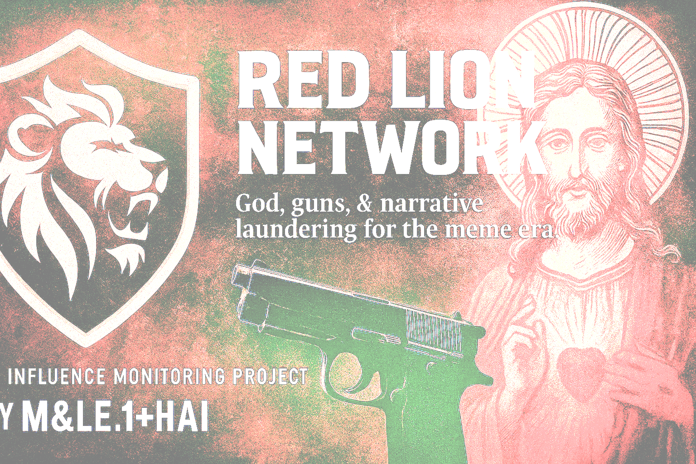

title: "Red Lion Network"
description: "Decoding the architecture of digital extremism—shell companies, narrative ops, and AI weaponization."
---

  

# 🦁 Red Lion Network

Welcome to the open-source intelligence project monitoring the most surreal modern threat to democracy: corporate cosplay crusaders with god, guns, and shell companies.

Built by **M&LE.1+H&AI**, this project exposes how:

- 🌐 Platforms amplify extremists  
- 🧠 AI reshapes belief  
- 🛡️ Shell companies launder violence  
- 🎭 Narrative warfare replaces truth  

---

## 🔍 Explore the Operation

- 📖 [Primer: What's Really Going On](docs/PRIMER.md)  
- 📜 [Timeline: From Minister to Mercenary](docs/TIMELINE.md)  
- 🧬 [Pattern Recognition Guide](docs/PATTERNS.md)  
- 🚩 [Threat Signature Checklist](docs/THREAT_SIGNATURES.md)  
- 🛠 [Action Plan: How to Fight Back](docs/ACTION_PLAN.md)  

---

## 📊 Tools & Evidence

- 🕸 Interactive Map: `ecosystem-map.html`  
- 🧮 Pattern Detector: `scripts/pattern-detector.py`  
- 📂 Full Schema: `analysis/red_lion_ecosystem/threat_schema.json`  

---

**This site is public. The threat was too.**

> *"If we don't tell the story, someone else will—wrong."*
